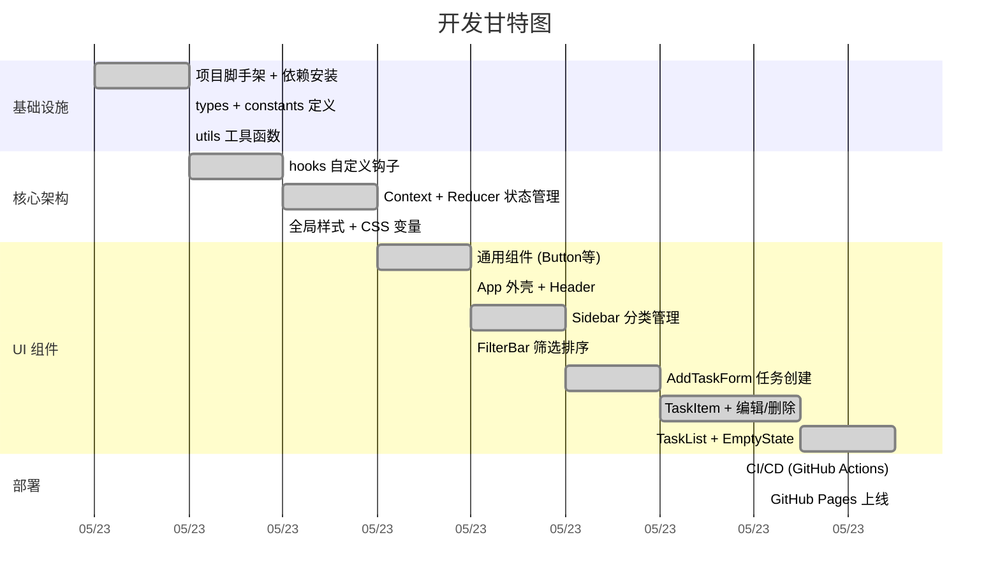

# 待办事项 - TaskFlow

一个基于 React + TypeScript + Vite 构建的待办事项管理应用，支持分类、优先级、截止日期，数据自动保存到浏览器本地存储。

## 功能

- **任务管理**：添加、编辑、删除、完成标记
- **优先级**：高 / 中 / 低 三级优先级，颜色区分
- **截止日期**：过期任务红色高亮提醒
- **分类管理**：自定义分类，每个分类可筛选
- **搜索排序**：标题+描述搜索，按截止日期/优先级/创建时间/字母排序
- **数据持久化**：localStorage 自动保存，刷新不丢失
- **离线可用**：纯前端应用，无需后端服务器

## 技术栈

| 类别 | 技术 |
|------|------|
| 框架 | React 19 |
| 语言 | TypeScript |
| 构建 | Vite |
| 样式 | CSS Modules + CSS 自定义属性 |
| 状态管理 | Context + useReducer |
| 持久化 | localStorage |

## 快速开始

```bash
# 安装依赖
npm install

# 启动开发服务器
npm run dev

# 生产构建
npm run build
```

## 项目结构

```
src/
├── types/          # TypeScript 类型定义
├── constants/      # 常量（默认分类、优先级映射等）
├── utils/          # 工具函数（日期、ID、存储）
├── hooks/          # 自定义 Hooks
├── context/        # 全局状态管理
├── components/
│   ├── Header/     # 标题栏 + 搜索框
│   ├── Sidebar/    # 分类侧栏
│   ├── FilterBar/  # 筛选排序栏
│   ├── TaskList/   # 任务表单、列表、统计
│   └── common/     # 通用组件
├── App.tsx
├── App.module.css
├── index.css
└── main.tsx
```

## 开发计划


